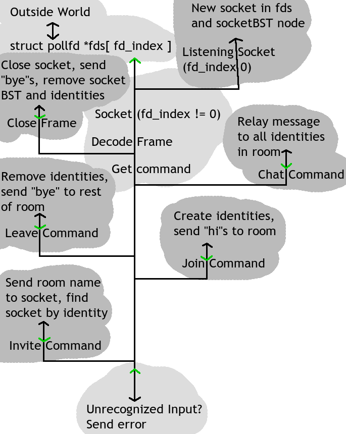
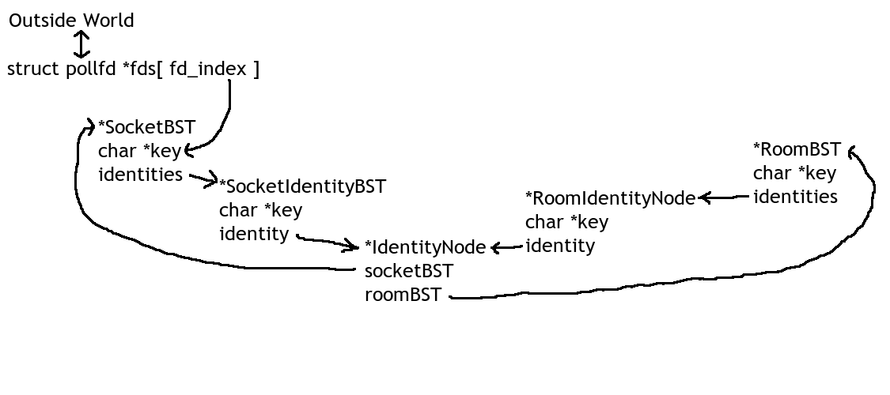

Documentation
=============

I will attempt to explain the general flow of the program, and how the data structes work. The code may do more than this, but this is the important stuff.

## Program flow

1. Start websocket server
    1. Allocate memory for `struct pollfd *fds`
    2. Create listener socket
    3. Set up signal handler for signal handler thread
    4. Create threads and mutexes
    5. Drop privileges from root to nobody (or a new user)
    6. Sleep main

2. Wait for signal, then handle signal
    1. Wait for signal
    2. Find socket that triggered the signal
    3. `if(fd_index == 0)`, listener socket is active and we need to accept a new socket. Goto 9
    4. Read data from socket and [decode the websocket frame](https://tools.ietf.org/html/rfc6455#section-5)
    5. If this is a close frame, close the socket, send "bye"s to room, remove all of this socket's identities, remove all empty rooms, and remove socket from socketBST. Goto 9
    6. `if(msg == "(null)")`, ignore the message and Goto 9. TBB will random send the message "(null)" for some reason...
    7. Determine command (the buffer should be a string with arguments delimited by NULL bytes. The command should be the first "string")
      - **chat**: This is a normal chat message. Relay it to everyone else in the room (all of `sender->roomBST->identites`)
      - **join**: An identity is being created. Send new identity a "join" response, everyone else in the room a "hi", and then that identity a "hi" for everyone already in the room in chronological order with older identity being first.
      - **invite**: Discreetly send a room name to a socket. Sending user should be in the room being sent, and the receiving socket will need to be found by identity.
      - **leave**: An identity is being destroyed. Send "bye"s to room, remove identity from identity BSTs, close empty rooms.
    8. Goto 4 until all data is read from socket buffer. Multiple frames may be waiting
    9. Free data, unlock thead mutex. Goto 1
 

## Command Format

Commands should be NULL delimited. Messages should be NULL terminated when being sent to the server, but not when being sent from the server

**NOTE:** The exact implementation of tripcodes is currently undecided. Things regarding tripcodes are likely to change!

To server:
  - `chat\0Room\0User\0Tripcode\0Message Here\0`
  - `join\0Room\0User\0`
  - `invite\0Existing Room\0User\0Tripcode\0New Room\0`
  - `leave\0Room\0User\0Tripcode\0`

From server (\u0000 is a NULL temrinator in JS):
  - `chat\u0000Speaker Username\u0000Speaker Tripcode\u0000Message\u0000Your Room\u0000Your Username`
  - `hi\u0000New User Name\u0000New User Tripcode\u0000New User Color\u0000Your Room\u0000Your Username`
  - `joined\u0000Your room\u0000Your Username`
  - Rest are to come

## Data

Before I get into the structs, I need to define a few things:

  - **identity**: A combination of room, username, and trip code that uniquely identifies a chatroom participant.
  - **BST**: A Binary Search Tree. This is used to navigate through multiple structs.
  - **Node**: A single struct contained in a BST, or an identity node.

Now I will list the data structures and what they are for:

  - `struct pollfd *fds` This holds all of the socket fds, which may be queried for activity using `poll()`
  - `fd_index` Not globally declared, but used many times in local context. `fd_index` is used to get the actual socket fd from `fds`.
  - `struct socketBST` Each socket has an entry in this BST.
  - `struct roomBST` Each room has an entry in this BST. Identities should be BST as well as be navigable chronologically with eldest identity being `first`.
  - `struct identityNode` This is the "identity". Should link back to its owning `socketBST` and `roomBST`.
  - `struct socketIndentityBST` A BST container pointing to `identityNode` used in `socketBST`.
  - `struct roomIndentityBST` A BST container pointing to `identityNode` used in `roomBST`.

